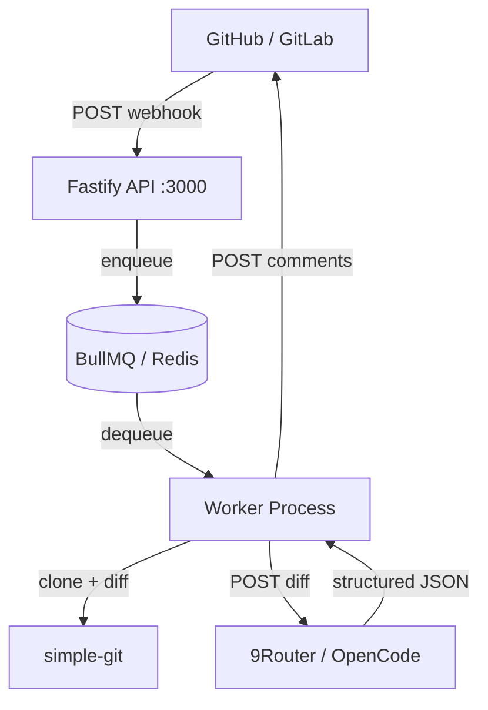

# AI Code Reviewer

**Version 0.1.0** | MIT License | Node.js / TypeScript

A self-hosted service that automatically reviews pull requests and merge requests using AI. It receives webhooks from GitHub or GitLab, generates a filtered diff, sends it to an AI model via 9Router, and posts inline comments directly on the PR/MR.

---

## Features

- **GitHub and GitLab support** — handles both `pull_request` and merge request webhook events out of the box
- **Inline AI comments** — posts structured comments at the exact file and line where an issue was found
- **Severity levels** — comments are tagged `INFO`, `WARNING`, or `CRITICAL`
- **Diff filtering** — skips lockfiles, build outputs, and binary assets; enforces a 40 KB diff size limit to keep AI context focused
- **Queue-based processing** — BullMQ + Redis decouple webhook receipt from the potentially slow AI call; the API always returns 202 immediately
- **Isolated workspaces** — each job clones to a temporary directory that is cleaned up regardless of outcome
- **Clean Architecture** — Domain / Application / Infrastructure / Presentation layers with dependency injection throughout
- **Docker-first** — three-stage, non-root Docker image ready for production deployment
- **Health endpoint** — machine-readable status for load balancers and uptime monitors

---

## Architecture Summary



The service runs as **two independent processes**: an API server that receives webhooks and a worker that performs the review. They communicate exclusively through a Redis-backed BullMQ queue.

See [Architecture Overview](getting-started/architecture-overview.md) for the full diagram and layer descriptions.

---

## Quick Start

> Assumes Node.js 22+, pnpm 9+, and Redis 7+ are available.

```bash
# 1. Clone the repository
git clone https://github.com/your-org/ai-code-reviewer.git
cd ai-code-reviewer

# 2. Install dependencies
pnpm install

# 3. Configure environment
cp .env.example .env
# Edit .env — fill in NINE_ROUTER_API_KEY, GITHUB_ACCESS_TOKEN, etc.

# 4. Build and start
pnpm build
node dist/presentation/web/server.js &   # API server
node dist/worker.js &                    # Review worker

# 5. Verify
curl http://localhost:3000/health
# {"status":"healthy","timestamp":"...","services":{"redis":"up","disk":"up"}}
```

For a guided walkthrough, see [Quick Start](getting-started/quick-start.md).

---

## Requirements

| Dependency | Minimum | Notes |
|---|---|---|
| Node.js | 22.x | LTS recommended |
| pnpm | 9.x | Package manager |
| Redis | 7.x | Queue + job state |
| Git | 2.x | Repo cloning |
| Docker | 24.x | Optional — production deployments |
| 9Router API | — | AI gateway; requires `NINE_ROUTER_API_KEY` |
| GitHub / GitLab | — | Network access for posting comments |

See [Requirements](getting-started/requirements.md) for the full prerequisites table.

---

## Documentation Index

| Section | Description |
|---|---|
| [Overview](getting-started/overview.md) | What the service does, who it is for, limitations |
| [Architecture Overview](getting-started/architecture-overview.md) | Layers, request lifecycle, design principles |
| [Requirements](getting-started/requirements.md) | Full prerequisites table |
| [Installation](getting-started/installation.md) | Step-by-step setup guide |
| [Quick Start](getting-started/quick-start.md) | Minimal path to first AI review |
| [First Review](getting-started/first-review.md) | Configure GitHub webhook, open a PR, see comments appear |

---

## Contributing

1. Fork the repository and create a feature branch.
2. Run `pnpm test` — all tests must pass.
3. Follow the existing Clean Architecture layer boundaries; do not import Infrastructure types from Domain or Application.
4. Open a pull request against `main` with a clear description of the change and the problem it solves.

---

## License

MIT — see [LICENSE](../LICENSE) for the full text.
