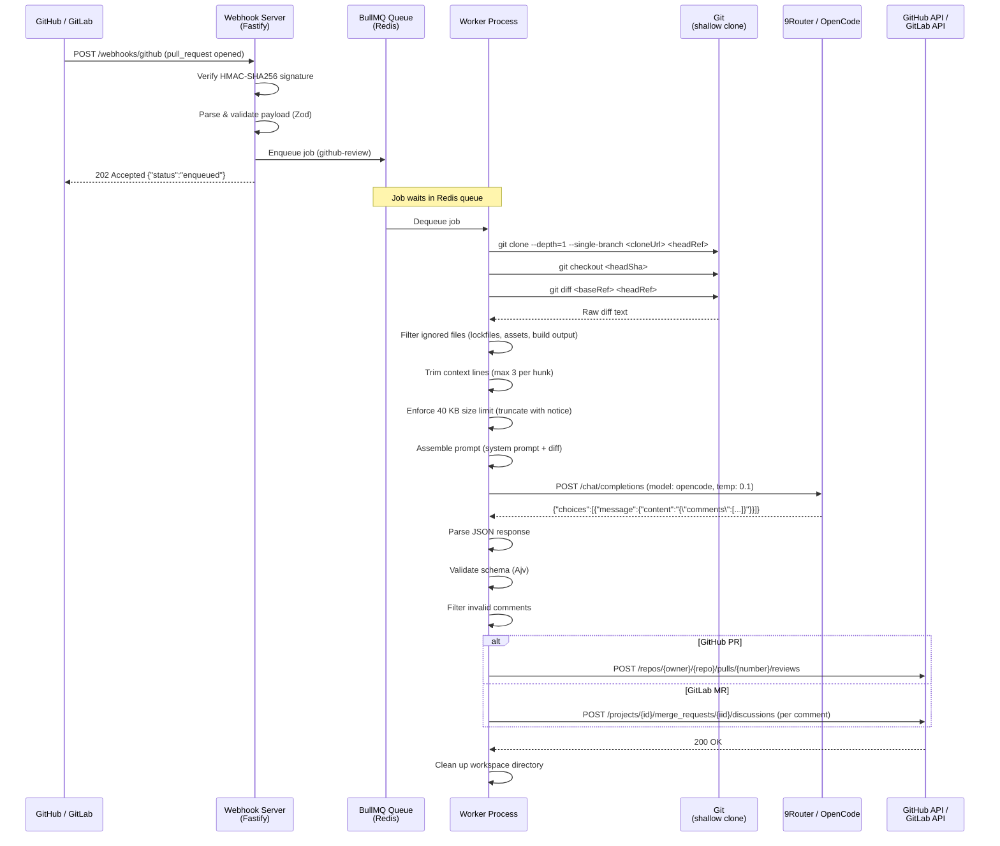

# Review Workflow

This document describes the complete lifecycle of a code review from webhook receipt to comment posting.

---

## End-to-End Sequence Diagram



---

## Stage Descriptions

### 1. Webhook Receipt

The Fastify server receives a `POST` to `/webhooks/github` or `/webhooks/gitlab`. Before any processing:

- **Signature verification** — GitHub uses `X-Hub-Signature-256` (HMAC-SHA256); GitLab uses `X-Gitlab-Token` (shared secret). Both use constant-time comparison. A `401` is returned on failure.
- **Payload validation** — Zod schemas validate the structure. A `400` is returned for malformed payloads.
- **Action filtering** — Events with unsupported actions (e.g. PR labeled, closed) return `200 {"status":"ignored"}` and are not queued.
- **Branch name safety** — Branch names are validated against `[a-zA-Z0-9_\-\/\.:]+` to prevent command injection.

### 2. Queue

The job is placed on a BullMQ queue backed by Redis. The webhook returns `202 Accepted` immediately — the HTTP response does not wait for the review to complete.

Job payload includes: provider, clone URL, head/base refs, commit SHAs, PR/MR number, and repository identifiers.

### 3. Worker Dequeue

A BullMQ `Worker` process dequeues the job. Concurrency defaults to 3 (configurable via `WORKER_CONCURRENCY`). Each job runs in its own async context within the worker process.

### 4. Git Clone and Diff

```bash
git clone --depth=1 --single-branch --branch <headRef> <cloneUrl> <workspacePath>/repo
git checkout <headSha>
git diff <baseRef> <headRef>
```

- `--depth=1` fetches only the most recent commit to keep clone times short.
- `--single-branch` avoids downloading all remote branches.
- The checkout targets the exact `headSha` to ensure the review reflects the precise commit that triggered the webhook.

### 5. Prompt Assembly

`PromptService.build(diff)` processes the raw diff:

1. Splits the diff into per-file blocks.
2. Filters out ignored files.
3. Trims context lines to 3 per hunk.
4. Assembles the filtered blocks and enforces the 40 KB byte limit.
5. Prepends the system prompt and appends the `--- GIT DIFF ---` separator.

### 6. AI Review

`NineRouterService.review(prompt)` sends the prompt to 9Router. The request has a 120-second timeout. The `response_format: json_object` parameter instructs OpenCode to return only valid JSON.

### 7. Parse and Validate

`ParserService.parse(rawText)`:

1. Strips accidental markdown fences.
2. Parses JSON.
3. Validates the envelope (`{ comments: [...] }`) with Ajv.
4. Validates each comment individually, logging and dropping invalid entries.

### 8. Post Comments

- **GitHub** — A single `createReview` call posts all comments as a batch review using `@octokit/rest`.
- **GitLab** — Each comment is posted as a separate `MergeRequestDiscussions.create` call using `@gitbeaker/rest`. Partial failures are logged but do not fail the job.

### 9. Cleanup

The workspace directory is deleted in a `finally` block, ensuring cleanup even when the job fails. Workspace paths follow the pattern `{WORKSPACE_DIR}/{uuid}/repo`.

---

## Timing Expectations

| Scenario | Approximate end-to-end time |
|---|---|
| Small PR (< 20 files, < 10 KB diff) | 30–60 seconds |
| Medium PR (20–100 files, 10–40 KB diff) | 60–90 seconds |
| Large PR (diff truncated at 40 KB) | 90–120 seconds (AI latency dominates) |
| Empty diff (no reviewable files) | < 5 seconds (skipped before AI call) |

The dominant cost is the AI inference time from OpenCode via 9Router. Git clone times are typically under 10 seconds for most repositories with `--depth=1`.

---

## Failure Modes

| Failure point | Behavior |
|---|---|
| Signature invalid | 401 returned; no job queued |
| Redis unreachable | 500 returned; no job queued |
| Git clone fails | Job fails; BullMQ retries with backoff |
| 9Router rate limit (429) | `AiProviderError` thrown; BullMQ retries |
| 9Router timeout | `AiProviderError` thrown; BullMQ retries |
| VCS API error (GitHub/GitLab) | Job fails; BullMQ retries |
| Job exhausts retries | Job moves to BullMQ failed set; no comments posted |

See [Retry Policy](./retry.md) for BullMQ retry configuration.
