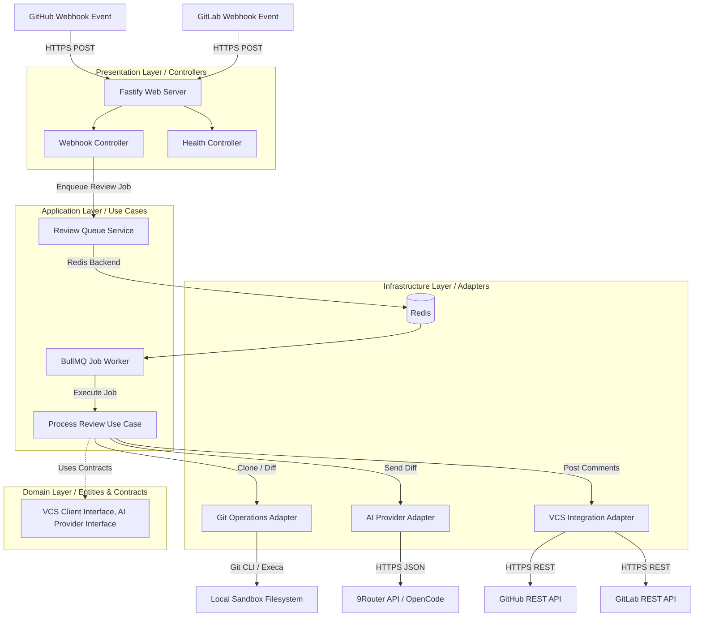

# System Architecture

## High-Level Architecture Diagram

The AI Code Reviewer is designed using Clean Architecture principles, ensuring separation of concerns, decoupling of external services, and testability.



---

## Component Responsibilities

The system is organized into four architectural layers:

### 1. Domain Layer
* The core of the system containing business models, enterprise rules, and interfaces (contracts).
* **Entities**: `ReviewJob`, `DiffReport`, `ReviewComment`, `RepositoryMetadata`.
* **Interfaces**: `IVcsClient` (defining comment posting and state updates), `IAiProvider` (defining prompt structure generation and payload exchange).
* This layer has **zero external dependencies** and is completely decoupled from frameworks (Fastify, BullMQ) and external APIs.

### 2. Application Layer
* Contains application-specific business rules and orchestrates the flow of data to and from the domain entities.
* **Use Cases**:
  * `EnqueueReviewJob`: Validates incoming webhook payload parameters and pushes jobs to the worker queue.
  * `ProcessReview`: Orchestrates checking out the Git branch, fetching diffs, running AI review prompts, parsing findings, posting comments, and cleaning up workspace files.
* Defines the interfaces for infrastructure adapters (dependency inversion).

### 3. Infrastructure Layer
* Implements the interfaces defined in the domain and application layers. This contains all detail-level logic and library choices:
  * **Git Operations Adapter**: Uses `simple-git` and `execa` to perform repository clone, checkout, fetch, and diffing.
  * **AI Provider Adapter**: Handles standard HTTP requests to 9Router, utilizing the OpenCode model. Formats the system prompt, includes the diff, enforces JSON schemas, and manages rate limiting or errors.
  * **VCS Integration Adapters**: Implement `IVcsClient` for GitHub (using `@octokit/rest`) and GitLab (using `@gitbeaker/rest`), handling OAuth or personal access tokens and commenting.
  * **Queue Service**: Implements the job queue and worker runner using `BullMQ` and `ioredis`.

### 4. Presentation Layer
* Receives external inputs and returns responses.
* **Web Server**: Built with `Fastify` for performance, low overhead, and structured logging.
* **Webhook Controller**: Parses webhook signatures, routes requests by provider, and delegates to the use case.
* **Health Controller**: Monitors the responsiveness of the web server and the Redis queue connection.

---

## Module Interaction

When a webhook is triggered:
1. The **Presentation Layer** validates the request payload and signature.
2. The controller invokes `EnqueueReviewJob` in the **Application Layer**.
3. The job payload is pushed to `BullMQ` (Infrastructure) and stored in `Redis`. The controller immediately returns `202 Accepted` to the client.
4. The asynchronous **Worker** pulls the job from `Redis`.
5. The Worker invokes the `ProcessReview` use case (Application).
6. The Use Case triggers the **Git Operations Adapter** (Infrastructure) to clone and diff.
7. The Use Case passes the diff to the **AI Provider Adapter** (Infrastructure).
8. The Use Case passes the resulting comments to the **VCS Adapter** (Infrastructure) to write comments back to the PR/MR.
9. The sandbox workspace is cleared.

---

## Request Lifecycle

Below is the step-by-step path of a review job:

```
[Webhook Event]
      │
      ▼
┌──────────────┐
│  API Gateway │ (Fastify Web Server)
└──────┬───────┘
       │ Validates Webhook Signature & Headers
       ▼
┌──────────────┐
│  Controller  │
└──────┬───────┘
       │ Invokes Enqueue Use Case
       ▼
┌──────────────┐
│  BullMQ Queue│ (Adds task to Redis Queue, Returns 202 immediately)
└──────┬───────┘
       │
   [Async Worker Polls Queue]
       │
       ▼
┌──────────────┐
│  Git Adapter │ (Clones repo to sandbox directory, checkout branch)
└──────┬───────┘
       │
       ▼
┌──────────────┐
│ Git Diff Gen │ (Generates unified diff between source and target branches)
└──────┬───────┘
       │
       ▼
┌──────────────┐
│  AI Adapter  │ (Constructs prompt, sends diff to OpenCode via 9Router)
└──────┬───────┘
       │
       ▼
┌──────────────┐
│ JSON Parser  │ (Validates response matching review schema)
└──────┬───────┘
       │
       ▼
┌──────────────┐
│ VCS Adapter  │ (Posts inline comments to GitHub/GitLab PR/MR)
└──────┬───────┘
       │
       ▼
┌──────────────┐
│  Cleanup FS  │ (Deletes workspace sandbox)
└──────────────┘
```

---

## Design Principles

* **Dependency Inversion**: High-level policies (business logic) do not depend on low-level details (APIs, Git libraries). Both depend on abstractions.
* **Single Responsibility**: Each module, class, or service has exactly one reason to change.
* **Isolation of Sandboxes**: Git operations run in isolated directories designated by unique, dynamically generated `UUID v4` job IDs to avoid concurrency collisions during execution.
* **Structured & Safe Output**: Reject free-form text from AI models. Enforce structured JSON schemas at the API gateway layer to prevent execution errors.
* **Input Validation & Sanitization**: Webhook payload parameters (such as branch names and repository URLs) must be validated using strict regex allowlists prior to execution.
* **Safe Subprocess Execution**: Subprocesses (like Git commands) must be executed by passing argument arrays to avoid shell execution contexts and prevent command injection vulnerabilities.
