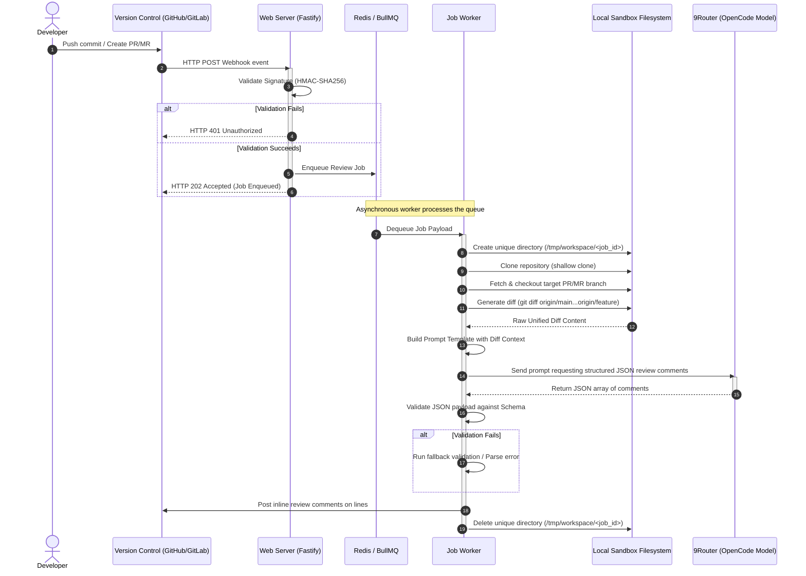

# AI Review Workflow

The complete review lifecycle is designed to be asynchronous, resilient, and parallel-safe. 

## Detailed Workflow Diagram



---

## Stage Descriptions

### 1. Webhook
* **Trigger**: A developer pushes code or opens/updates a Pull Request/Merge Request.
* **Payload Verification**: 
  * The presentation layer extracts the signature header (`X-Hub-Signature-256` for GitHub, `X-Gitlab-Token` for GitLab).
  * It verifies the signature against the preconfigured webhook secret using a cryptographic timing-safe comparison.
  * If valid, the raw payload is validated against a strict JSON schema. Metadata values like branch names and repository URLs are checked against a strict regex allowlist (e.g. `/^[a-zA-Z0-9_\-\/\.:]+$/`) to prevent command injection and path traversal attempts.
  * Successfully validated metadata (repository URL, source branch, target branch, PR/MR ID, and SHA) are mapped to a standardized integration contract.

### 2. Queue
* The webhook handler enqueues a new job containing the standardized metadata into BullMQ.
* Enqueuing is backed by Redis persistence.
* This returns an HTTP status of `202 Accepted` to GitHub/GitLab immediately, keeping connection hold times minimal (under 50ms) to prevent timeout errors from the VCS provider.

### 3. Worker
* A standalone background worker process polls the BullMQ Redis queue.
* Upon picking up a job, the worker instantiates a new execution unit and assigns it a unique, newly-generated `UUID v4` Job ID.
* Configured retry policies kick in if the execution fails due to temporary network blips or rate limits.

### 4. Git Operations
* **Sandbox Isolation**: The worker creates a unique subdirectory under the configured workspace directory (e.g. `/tmp/workspace/job-<job-uuid>`), verifying that the path does not escape the workspace root.
* **Cloning**: Executes a shallow git clone limiting depth and target branch:
  ```bash
  git clone --depth=1 --single-branch --branch <source_branch> <repo_url>
  ```
  This is executed by passing arguments as an array (`['clone', '--depth=1', '--single-branch', '--branch', sourceBranch, repoUrl, targetDir]`) to `execa` to prevent shell parser exploits.
* **Fetch & Checkout**: Safely fetches and checks out the target commit SHA.
* **Diff Generation**: Generates a unified git diff against the target branch. Command arguments are structured as an array to guarantee parameter boundary isolation.

### 5. Prompt Generation
* The application layer loads the system prompt template.
* It embeds structural context:
  * Modified file paths.
  * Extracted git diff blocks.
  * Programming languages detected.
  * Strict instructions regarding response formats.

### 6. AI Execution
* The prompt is sent via HTTPS POST to the 9Router gateway pointing to the `OpenCode` model.
* Temperature is kept low (e.g., `0.1` or `0.2`) to reduce hallucinations and maximize consistency in reviews.
* Requests configure `response_format: { type: "json_object" }` to ensure structured JSON output.

### 7. JSON Parser & Validation
* The raw string response from the AI gateway is parsed.
* It is validated against a strict JSON schema:
  ```json
  {
    "comments": [
      {
        "filePath": "src/index.ts",
        "lineNumber": 42,
        "message": "Change variable assignment here to avoid memory leaks...",
        "severity": "WARNING"
      }
    ]
  }
  ```
* If validation fails, fallback logic checks for partial JSON or attempts a retry. Invalid outputs are discarded to protect VCS comment threads from garbage text.

### 8. VCS Comment Posting
* The VCS adapter translates the validated review comments into specific REST requests for the integration provider.
* For **GitHub**: Calls the Pull Request Review Comments API (`POST /repos/{owner}/{repo}/pulls/{pull_number}/comments`), providing the commit SHA, path, side (line side), and line number.
* For **GitLab**: Calls the Merge Request Discussions API (`POST /projects/{id}/merge_requests/{merge_request_iid}/discussions`).

### 9. Cleanup
* The worker deletes the sandboxed directory recursively from the local filesystem (`rm -rf /tmp/workspace/job-<job-uuid>`).
* This step runs inside a `finally` block to ensure filesystem cleanup executes even if the execution fails at any step of the process.
