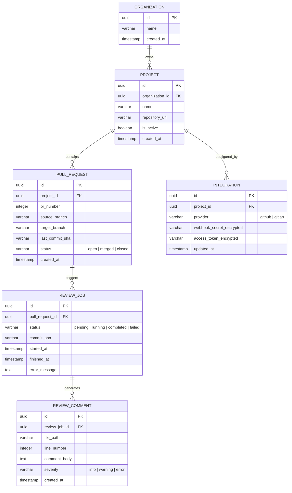

# Database Schema Design (Future Phase)

Although the MVP does not require a database (relying on memory, configuration variables, and BullMQ Redis state), a production-grade enterprise release needs a relational database (PostgreSQL) to store persistent configurations, history, and analytics.

---

## Entity-Relationship (ER) Diagram

---

## Table Layouts & Schema Definition

### 1. `organizations`
Groups projects and configurations, enabling multi-tenancy in future releases.
* `id` (UUID, Primary Key): Unique organization identifier.
* `name` (VARCHAR): Organization name.
* `created_at` (TIMESTAMP): Creation date.

### 2. `projects`
Stores VCS repositories.
* `id` (UUID, Primary Key).
* `organization_id` (UUID, Foreign Key referencing `organizations.id`).
* `name` (VARCHAR): Display name of repository.
* `repository_url` (VARCHAR): Git clone target URL.
* `is_active` (BOOLEAN): Flag to enable/disable automated reviews on commit.
* `created_at` (TIMESTAMP).

### 3. `integrations`
Encapsulates credentials needed to communicate with GitHub/GitLab.
* `id` (UUID, Primary Key).
* `project_id` (UUID, Foreign Key referencing `projects.id`).
* `provider` (VARCHAR): Target VCS type (e.g. `'github'`, `'gitlab'`).
* `webhook_secret_encrypted` (VARCHAR): Encrypted signing secret to validate webhooks.
* `access_token_encrypted` (VARCHAR): Encrypted OAuth/Personal Access Token for API actions (posting comments, modifying PR status).

### 4. `pull_requests`
Tracks pull request entities across synchronization payloads.
* `id` (UUID, Primary Key).
* `project_id` (UUID, Foreign Key referencing `projects.id`).
* `pr_number` (INTEGER): The ID number defined by the VCS (PR # or MR IID).
* `source_branch` (VARCHAR).
* `target_branch` (VARCHAR).
* `last_commit_sha` (VARCHAR).
* `status` (VARCHAR): The current life status (`'open'`, `'merged'`, `'closed'`).

### 5. `review_jobs`
Logs every review event.
* `id` (UUID, Primary Key).
* `pull_request_id` (UUID, Foreign Key referencing `pull_requests.id`).
* `status` (VARCHAR): Status indicator (`'pending'`, `'running'`, `'completed'`, `'failed'`).
* `commit_sha` (VARCHAR): The target commit analyzed during this run.
* `started_at` (TIMESTAMP): Timestamp when worker checked out code.
* `finished_at` (TIMESTAMP): Completion timestamp.
* `error_message` (TEXT): Log details if compilation or AI generation failed.

### 6. `review_comments`
Caches the review feedback outputted by the AI.
* `id` (UUID, Primary Key).
* `review_job_id` (UUID, Foreign Key referencing `review_jobs.id`).
* `file_path` (VARCHAR): Location of modified file.
* `line_number` (INTEGER): Code line referenced.
* `comment_body` (TEXT): Review message.
* `severity` (VARCHAR): Notification level (`'info'`, `'warning'`, `'error'`).

---

## Design Reasoning

* **Relational Consistency**: Postgres ensures database transactions (ACID properties) are respected, which prevents race conditions when concurrent webhooks trigger reviews for the same pull request.
* **Separation of Integrations**: Credentials and tokens are kept in a separate `integrations` table rather than the `projects` table. This allows rotation of keys, multiple credentials per project, or changing authentication providers without altering the main project records.
* **Secure Encryption**: Secret attributes (webhook secrets, API tokens) must be stored encrypted at rest (e.g., using AES-256-GCM) with an application key managed via KMS.
* **Performance Indexes**: Indexes are placed on foreign key relationships (`project_id`, `pull_request_id`) and search targets (`last_commit_sha`, `pr_number`) to keep retrieval times low as records scale.
