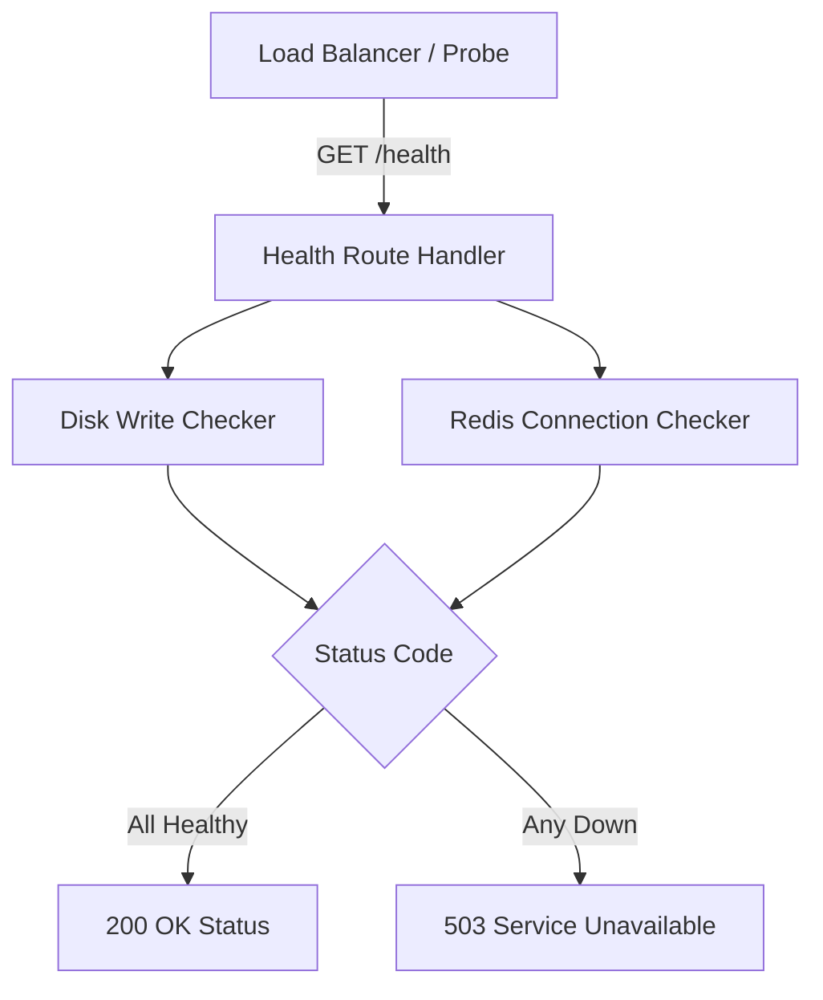

# Health Check Specification

## Purpose
Expose status metrics to load balancer probes.

## Responsibilities
* Check local disk availability.
* Check Redis connections.
* Expose diagnostics payloads.

## Dependencies
* External: `fastify`.
* Internal: `RedisConnectionClient`.

## Folder Structure
```text
src/presentation/web/routes/
└── health.ts         # Route handler for /health checks
```

## Data Flow

